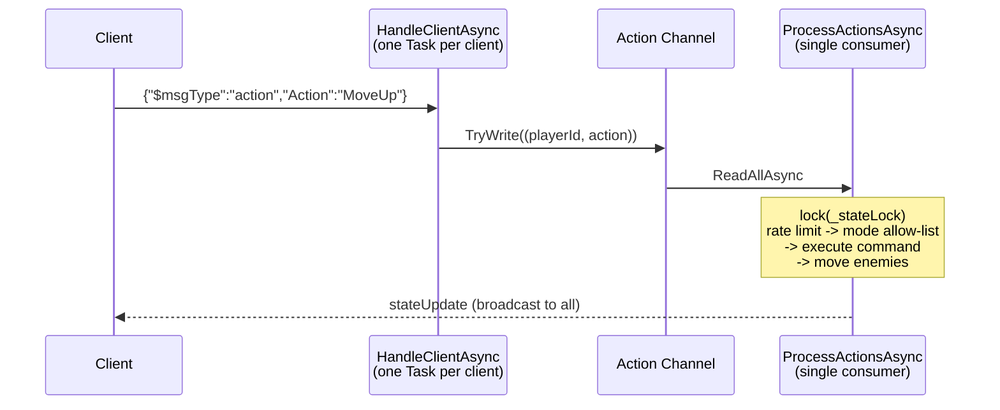

# Labyrinth Mayhem

A terminal dungeon crawler in C# that runs either as a single-player game or as a multiplayer session backed by an authoritative TCP server supporting up to 9 concurrent players.

The game itself is a roguelike on a 20×40 grid: explore a procedurally generated dungeon, pick up items, equip weapons, fight enemies, and stay alive. The more interesting half of the project is the architecture underneath — a strict model/view separation that allows the exact same game core to be driven by a local keyboard loop or by a network server that owns all state and validates every client action.

---

## Running

Requires the .NET 10 SDK.

```bash
dotnet build
```

The game has three launch modes:

```bash
# Single-player, local
dotnet run

# Host a server on port 5555
dotnet run -- --server 5555

# Connect to a server as a client
dotnet run -- --client 127.0.0.1:5555
```

Running `dotnet run` with no arguments prompts interactively for server/client/local instead.

### Configuration

`src/ProJob/config.json` is copied to the output directory on build:

```json
{
  "playerName": "Gienio",
  "dungeonTheme": "library",
  "journalSavePath": "."
}
```

`dungeonTheme` accepts `library`, `steampunk`, or `vault` (unknown values fall back to `library`). Session logs are written to `<journalSavePath>/Logs/<playerName>_<timestamp>.log`.

---

## Controls

| Mode | Keys | Action |
|---|---|---|
| Exploration | `W`/`A`/`S`/`D` or arrows | Move (walking into an enemy starts combat) |
| | `E` | Pick up the top item on your tile |
| | `I` | Open inventory |
| | `F` / `G` | Unequip left / right hand |
| | `J` | View the session journal |
| | `Esc` | Quit *(local game only)* |
| Inventory | `W`/`S` or `↑`/`↓` | Scroll |
| | `<-` / `->` | Page up / down |
| | `L` / `R` | Equip to left / right hand |
| | `D` | Drop |
| | `I`, `Q`, `Esc` | Close |
| Combat | `1` | Normal attack |
| | `2` | Stealth attack |
| | `3` | Magic attack |
| | `Esc` | Flee |

Local bindings live in `KeyBindingMap.CreateDefault()` and are remappable; the network client carries its own fixed per-mode key tables. Multiplayer clients exit by closing the terminal rather than with `Esc`.

---

## Architecture

### The model/view boundary

Everything under `Core`, `Board`, `Player`, `Combat`, `Items`, and `Commands` is pure logic — it never touches `Console` and knows nothing about sockets. Views are passive and only draw:

- `ConsoleRenderer` renders a local `GameState` directly.
- `NetworkClientView` renders a flattened `MultiPlayerStateDto` received over the wire.

This is what makes the same command classes reusable on both sides: `GameLoop` executes them against a local state, and `GameServer` executes instances of the same `ICommand` implementations against a server-side state.

### Multiplayer

The server is the single source of truth. Clients send action *names*, never state — they cannot move themselves, only ask to be moved.



The concurrency model has three deliberate pieces:

A single-consumer action channel. Every inbound action from every client is funnelled into one unbounded `Channel<(int, ActionMessage)>` and drained by a single `ProcessActionsAsync` loop. Rather than letting *N* client tasks contend over the world, all mutation happens on one logical thread of execution, in arrival order.

Lock-guarded snapshots. `_stateLock` guards the shared board, the per-player states, and the free-ID queue. Broadcasts build their DTOs *inside* the lock and send them *outside* it, so a client's slow socket can never stall world updates for everyone else.

Per-client send serialization. Each `ConnectedClient` owns a `SemaphoreSlim`, so concurrent broadcasts (a state update and a noise event arriving at once) can't interleave two JSON documents on the same stream.

Server-side validation runs on every action before anything executes:

| Check | Effect |
|---|---|
| Player is alive | Dead players' actions are dropped |
| `MinActionIntervalMs` = 150 ms | Rate limit per player; faster input is discarded |
| `AllowedActionsByMode` | An action not legal in the player's current mode is refused — a client can't attack while in the inventory, or scroll the inventory mid-combat |
| Known command name | Unrecognized action strings are ignored |

Disconnects are handled in a `finally` block that unregisters the player, clears any combat they were in, recycles their player ID back into the free queue, re-reconciles combat state across remaining players, and broadcasts the departure. Malformed JSON from a client is caught explicitly (`JsonException`) and drops only that connection.

### Wire protocol

Newline-delimited JSON over TCP, with `System.Text.Json` polymorphic serialization via a `$msgType` discriminator. Each message implements `INetworkMessage.Execute(INetworkMessageHandler)` — double dispatch, so adding a message type forces both the client and the server router to handle it at compile time.

| `$msgType` | Direction | Payload |
|---|---|---|
| `handshake` | server -> client | Assigned player ID + full initial state |
| `stateUpdate` | server -> client | Per-recipient `MultiPlayerStateDto` |
| `noiseEvent` | server -> client | Noise source, range, distance to this player |
| `playerLeft` | server -> client | Departing player ID |
| `action` | client -> server | Action name |
| `journalLog` | server -> client | One journal entry, pushed as it's logged |

Note that `stateUpdate` is built *per recipient*: `ToMultiPlayerDto` projects the world from that player's perspective, listing everyone else as `OtherPlayerDto` entries. Each client gets its own view, not a shared blob.

`journalLog` entries are pushed to every client as they're written, via `NetworkJournalObserver` subscribed to the server's `FileJournal`; viewing the journal (`J`) just reads that client-side replica, with no request/response round trip to the server.

### Dungeon generation

`DungeonDirector` (Builder) composes a dungeon from an `IDungeonThemeFactory` (Abstract Factory). A theme supplies a generation template, item and enemy factories, species groups, an artifact, and spawn counts — so `library`, `steampunk`, and `vault` produce structurally different dungeons through one build pipeline. `DungeonBuilder` and `InstructionsBuilder` both implement `IDungeonBuilder`, meaning the same build script that constructs the map also generates the in-game help text describing what's in it.


### Combat

Attacks use the Visitor pattern to resolve damage by weapon category without type-switching. `NormalCombatVisitor`, `StealthCombatVisitor`, and `MagicCombatVisitor` each implement `VisitHeavy` / `VisitLight` / `VisitMagic` / `VisitNone`, so combat *style* and weapon *type* vary independently — a stealth attack doubles light-weapon damage but halves heavy-weapon damage, all without either class knowing about the other.

The visitor threads a `context` item through the call, which is what makes it compose with decorated weapons: `AcceptAttack` delegates inward to the base weapon for dispatch but reports the *decorated* item's damage.

### Items

`ItemDecorator` wraps any `IItem` to layer on modifiers — `StrongModifier` adds +5 damage and renames the item, `ProtectiveModifier` and `UnluckyModifier` behave similarly. Because decorators implement the full `IItem` interface (including equip/unequip and visitor dispatch), a decorated weapon is indistinguishable from a plain one everywhere else in the codebase.

### Events and the noise system

`DungeonEventBus` is an `Observable<NoiseEvent>` that enemies subscribe to on construction. When a player picks up a noisy item, the bus runs a BFS flood fill across walkable tiles and publishes the reachable set with distances — so sound propagates *through the dungeon's corridors*, respecting walls, rather than by straight-line radius. Heavy weapons are loudest (5), magic 3, light 1.

Separately, `Species` is an `Observable<Enemy>`: when one enemy dies, surviving members of its species are notified and react through an `IDeathBehavior` strategy — `AggressiveDeathBehavior` makes them hit harder, `CowardlyDeathBehavior` makes them weaker and less armored.

In multiplayer, `NetworkNoiseObserver` bridges the bus to the network, forwarding a `noiseEvent` only to clients whose position actually falls inside the reachable set.

### Command dispatch

Input resolution is a Chain of Responsibility selected by mode. `GameModeDetector` holds one chain per `PlayMode`, each terminating in `UnknownKeyCommandHandler`. A handler returns an `ICommand` or defers to the next link. The server reuses the same `ICommand` implementations through a name -> factory dictionary, which is why local and networked play can't diverge in behavior.

### Journal

`FileJournal` is a lazily-initialized singleton writing timestamped entries to both memory and disk under a `lock`. Server-side entries are tagged with `[Gracz #N]` so a multiplayer log is attributable per player.

---

## Project layout

```
src/ProJob/
├── Core/          GameState, GameLoop, PlayMode, GameModeDetector
├── Board/         Board grid, Cell hierarchy
├── Player/        Player, attributes, inventory, PlayerRegistry
├── Items/         IItem, decorators, weapons, collectibles, currencies
├── Combat/        Enemy hierarchy, combat visitors, species, death behaviors
├── Commands/      ICommand implementations + handler chains
├── Builder/       DungeonBuilder, DungeonDirector, build strategies
├── Themes/        Theme factories and generation templates
├── Events/        DungeonEventBus, NoiseEvent
├── Observer/      Observable<T>, IGameObserver<T>
├── Network/       GameServer, GameClient, DTOs, messages, serialization
├── Rendering/     ConsoleRenderer, NetworkClientView
├── Input/         KeyBindingMap, ConsoleInputSource
├── Journal/       FileJournal
└── Config/        GameConfig + loader
```

## Design patterns used

| Pattern | Where |
|---|---|
| Builder + Director | `DungeonBuilder`, `InstructionsBuilder`, `DungeonDirector` |
| Abstract Factory | `IDungeonThemeFactory` and the three themes |
| Visitor | `ICombatVisitor` over weapon categories |
| Decorator | `ItemDecorator` and the item modifiers |
| Observer | `Observable<T>`, `DungeonEventBus`, `Species` |
| Strategy | `IDeathBehavior`, `IDungeonBuildStrategy` |
| Command | `ICommand` implementations |
| Chain of Responsibility | `CommandHandler` chains per play mode |
| Singleton | `FileJournal` |
| DTO / double dispatch | Network layer message protocol |
